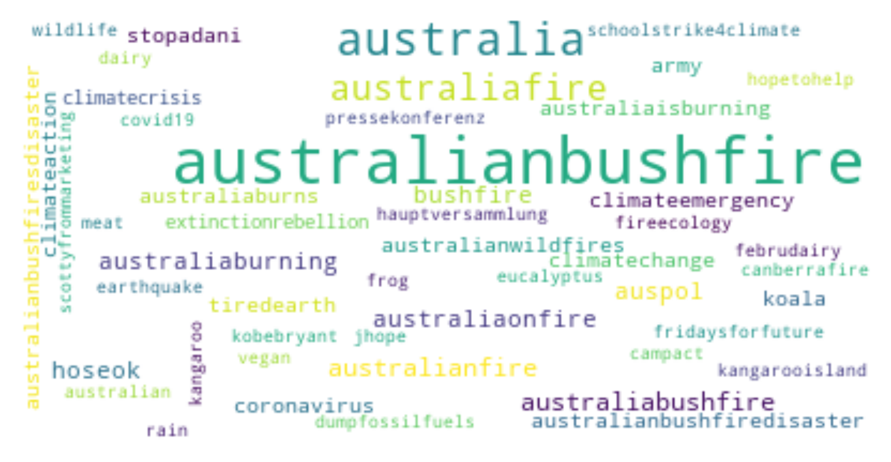
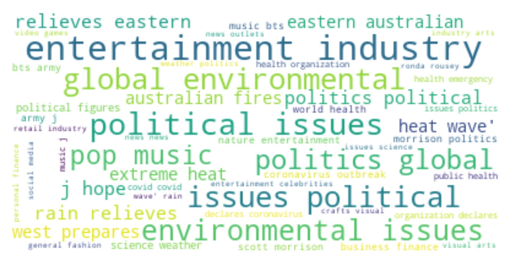

# Keyword Analysis - Australia

This notebook analyses the tweets scrapped using the keywords "" and helps in identifying relevant keywords associated
to Australian bush fires.## 1. hashtags and context annotations at a glance
Hashtags are used by users to associate a tweet with a topic on social media. Context annotations are generated by
twitter's NLP algorithm to provide a context to the tweet.

**Following common hashtags are observed in the dataset.**

 

 

Note: All kind of hashtags are visible here. Some notable are "australiabushfire", "climatereaction" and other targeting
mining industry (adani) and fossil fuels.
P.S. I will improve the image dpi for better visibility

However, Hashtags are not reliable as users often use them to get a better reach. Therefore, I also made a wordcloud of
common context annotations in the sample tweets.

**Following common context annotations observed in the dataset.**

 

 

Most of the context shown here seems relevant for the topic.

                        

            

    

	